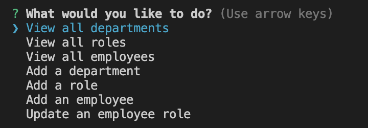

# Employee-Tracker

## Description

The purpouse of this is to further explore SQL and MySQL using inquirer. It's a CLI app to manage employees and departments.

## Installation

To install, run 'npm i' in your dedicated terminal. Then connect to sql, and targeting the db folder, type 'source schema.sql', followed by 'source seeds.sql'. Finally in a new terminal type 'node index' to run the app.

## Usage

## Features

If your project has a lot of features, list them here.